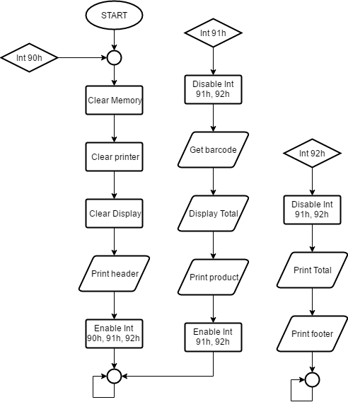

# Trabalho de Assembly - UFSC

Eduardo Henke

Bruno M. Pacheco

Nathan Willian  D. S.


## O que falta fazer:
Obs: tenta modularizar o código, deixando funções bonitinhas ao invés de ```n``` linhas de código pra uma função básica
### Agora
* Pegar e tratar input do DOS(Henke)
* Proc pra registrar produtos(Henke)
### Feito
* ~~Tratador de interrupção, painel das LEDs(Alfinete)~~
* ~~Main loop e integração(Alfinete)~~
* ~~Procedure para imprimir nome e preço formatados(Alfinete)~~
* ~~Procedures para limpar impressora/display~~
* ~~Mostrar no display(Henke)~~
* ~~Calcular total e mostrar na tela a cada get_product(Henke)~~
* ~~Pegar input das chaves(Alfinete)~~
* ~~Procedures para pegar produtos/preços pelo ID~~


## Diagrama



## Estrutura dos dados:
```
data segment
    ;IDs         0          1           2         3
    products db "ERROR$", "macarrao$", "leite$", "quiboa$"
    prices   dw 0FFFFh,   350,         1399,       299
ends
```
